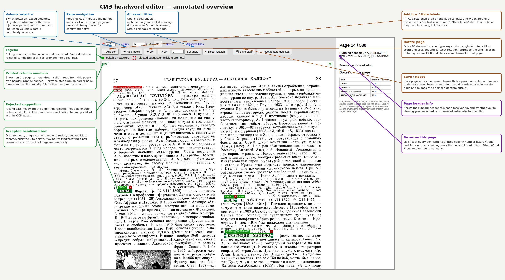

# Kolonka

OCR pipeline and web editor for extracting and correcting headword
indexes from scanned two-column reference volumes (DjVu).

Turns a scanned dictionary/encyclopedia volume into a structured,
correctable index of headwords and their printed page numbers. Built
around Tesseract OCR with bold-text detection to find headwords, an
interactive web editor for reviewing and fixing entries directly
against the page image (drag/resize boxes, click-to-promote rejected
candidates, live re-OCR on edit), and SQLite storage. Handles the
two-columns-per-page numbering scheme common in this era of reference
publishing, including automatic extrapolation and manual correction of
column numbers when a page's own header can't be read.

Originally built for digitizing the *Soviet Historical Encyclopedia*
(Советская историческая энциклопедия), but the pipeline itself isn't
specific to that text — it should work for any scanned reference work
with a similar two-column-per-page layout and running headers.



## Features
- Tesseract-based OCR with a bold-stroke heuristic (not just font
  size) to tell real headwords apart from regular body text on a
  bilevel scan, tuned against real 1960s–70s letterpress printing.
- Interactive web editor: drag to move, resize via corner handles,
  double-click to rename, click red "rejected candidate" suggestions
  to promote them — every edit re-reads the text from the image
  automatically.
- Per-column printed page numbers, with extrapolation across
  unreadable headers and one-click manual correction when the header
  or extrapolation gets it wrong.
- Page rotation (quick 90° turns or arbitrary angles for deskewing),
  applied before OCR so everything downstream stays consistent.
- Multi-volume support with per-session volume switching.
- Everything lands in a plain SQLite database — easy to export,
  query, or hand off to something else entirely.

## Requirements
- Python 3.9+
- [Tesseract OCR](https://github.com/tesseract-ocr/tesseract) with the
  language pack(s) for your source text (e.g. `tesseract-ocr-rus` on
  Debian/Ubuntu) and `tesseract-ocr-eng` for transliterations
- [DjVuLibre](http://djvu.sourceforge.net/) (`ddjvu`, `djvudump`) if
  your source is DjVu

## What it shows
- The rendered page image, with editable overlay boxes.
- Every box starts out either **auto-detected** (green, accepted
  headwords) or a **suggestion** (dashed red, a candidate that looked
  like a headword but got rejected — click one to promote it into a
  real, editable box).
- Anything with **no box at all** around real headword text is a
  total miss the algorithm never even flagged — draw a new one
  yourself.

## Setup
```bash
sudo apt-get install -y djvulibre-bin tesseract-ocr tesseract-ocr-rus tesseract-ocr-eng
pip install flask pytesseract pillow scipy numpy --break-system-packages
```

## Run
```bash
python3 app.py /path/to/СИЭ-01.djvu
# then open http://127.0.0.1:5000 in your browser
```

Or with multiple volumes (see "Working with multiple volumes" below):
```bash
python3 app.py /path/to/СИЭ-01.djvu /path/to/СИЭ-02.djvu
```

Optional flags:
```bash
python3 app.py file.djvu --port 8080 --start-page 13
```

## Working with multiple volumes
Pass more than one `.djvu` file on the command line to work across
several volumes in one running server:

```bash
python3 app.py "СИЭ-01.djvu" "СИЭ-02.djvu" "СИЭ-03.djvu"
```

A **📚 volume selector** dropdown appears in the nav bar (both the
page editor and `/titles`) whenever more than one volume is loaded —
it's hidden automatically in single-volume mode, so nothing changes
for you if you only ever pass one file.

Which volume is "current" is tracked per browser session (a cookie),
so different browser tabs/windows can each be looking at a different
volume independently. **Every page — the editor, `/titles`, and every
API endpoint — only ever shows data for the currently-selected
volume.** Switching volumes while you have unsaved edits on the
current page asks for confirmation first, the same as navigating away
any other way.

Each volume's cache files and saved database rows are keyed by its
filename stem (e.g. `СИЭ-01`), so they're completely independent —
saving, resetting, or rotating a page in one volume never touches
another. Two files that would resolve to the same stem (e.g. same
filename in different folders) is a startup error, since the database
and cache can't tell them apart.

## Editing
- **Drag** a box to move it — the text is automatically re-read from
  the new position once you let go.
- **Drag a corner handle** to resize it — same auto re-read on release.
- **"+ Add box"**, then click-and-drag to draw a new box — it OCRs
  the region you just drew and pre-fills the title prompt with what it
  read, so you can just confirm or correct it rather than typing from
  scratch.
- **Double-click** a box any time to rename it manually.
- Click the **×** to delete a box.
- Click **"💾 Save page"** to write the page's box list to the SQLite
  database (see below). It's saved per page, so you can leave and come
  back without losing work.
- Click **"↺ Reset to auto-detected"** to discard your saved edits for
  that page and reload the original algorithm output.

## Unsaved-changes warning
Any edit (move, resize, rename, delete, new box, or promoting a
suggestion) marks the page as **dirty**: a red "● Unsaved changes"
indicator appears next to the nav controls and the Save button gets
highlighted. If you then try to leave the page — Prev/Next, jump to a
page number, "All saved titles", or even closing/refreshing the browser
tab — you'll get a confirmation prompt asking whether to discard the
changes. Clicking "Save page" clears the dirty state.

## Rotating a page
- **"⟲ 90°" / "⟳ 90°"** for quick quarter-turns.
- **Angle box + "Set angle"** for any arbitrary angle (e.g. `1.5` or
  `-2.3`) — useful for deskewing a scan that's just slightly tilted
  rather than fully sideways. The box is pre-filled with the page's
  current rotation each time you load it, so you can nudge from there.
- **"↩ Reset rotation"** sets it straight back to 0° (the original,
  unrotated scan).

Rotation is baked in at render time — right after `ddjvu` produces the
raw scan, before OCR ever touches it — and stored per-page (as a float
degree value) in the `page_rotations` table, so it applies consistently
to everything: the display image, the OCR/detection pass, and
box-level re-reads. Non-90°-multiple angles use bicubic resampling and
expand the canvas, filling the newly-exposed corners white to match
the scan's paper background.

Because rotating changes the pixel orientation everything else is
measured against, it:
- forces a fresh OCR pass for that page (the old analysis, in the old
  orientation, is discarded), and
- **clears any saved boxes and dismissed suggestions for that page**,
  since their coordinates wouldn't correspond to anything sensible
  after rotating. You'll get a confirmation prompt before this happens.

Rotate a page *before* you start annotating it, not after — there's no
coordinate-remapping of existing work, just a clean slate under the
new orientation.

### "Boxes on this page" table
Shows a live **"Start #"** for each box — the actual printed column
page number (e.g. `27` or `28`) it falls in, computed from the page's
own running header and which half of the page the box's left edge is
in. This updates in real time as you drag a box across the
left/right boundary, so you can immediately see which printed page a
title will be attributed to before you even save.

**"End #"** is for entries that span more than one printed
column/page — it's empty by default (there's no way to auto-detect
where a multi-column entry actually ends) and purely manual.

**Click either cell to set/clear it manually.** For "Start #", this
is useful when the header didn't parse for that page, or the
auto-detected number is simply wrong — type a number to override it,
or leave the prompt blank to go back to auto-detecting from the
header (shown with a small ✎ marker while overridden). Once saved, a
value sticks permanently for that box (marked `guessed=0` in the
database, same as a successfully header-derived value) until you
clear it or reset the page. These same two values are also directly
editable later from the `/titles` browse page (see below), without
needing to reopen this editor.

## Manually correcting a page's column numbers
**Click either on-page column-number badge** (top-left/top-right of
the page image) to directly set both numbers, e.g. type `45/46`. This
is different from overriding an individual box's "Start #"/"End #" —
it corrects the *page's own* printed column numbers, which matters
because those numbers are also used as the extrapolation anchor for
any later page whose own header can't be parsed. So fixing a wrong
number here also fixes the knock-on effect on every later page that
would otherwise have extrapolated from it.

A manually-set page shows its badges in **blue** (vs. green for
directly-parsed, orange-dashed for extrapolated) and always takes
priority over both auto-detection and extrapolation. Click a blue
badge and leave the prompt blank to clear the override and go back to
auto-detection.

## Column numbers shown on the page
The printed column numbers (e.g. `27` / `28`) now also appear directly
on top of the page image — top-left and top-right corners, matching
where they'd actually print — not just in the sidebar text. **Green,
solid border** means read directly from that page's own header;
**orange, dashed border** means extrapolated from an earlier page (see
above). Hover over either badge for a one-line explanation of which
case it is.

## Deducing column numbers when the header can't be parsed
Some pages (illustrations, maps, tables) don't have a parseable
running header of their own. For those, the app now searches earlier
pages in the same volume for the nearest known column number and
extrapolates forward — two columns (one page) at a time — up to the
current page. E.g. if page 14 is known to be columns 27/28 and page 15
has no readable header, page 15 is deduced as 29/30.

This search only uses information that's already available for free —
a previously-cached page analysis, or already-saved (non-guessed)
database rows — and deliberately never triggers a fresh render+OCR on
some other page just to search it, since that could mean silently
OCRing dozens of pages you haven't even opened yet on every single
save. If nothing usable turns up anywhere earlier in the volume (e.g.
you're working near the very start), it falls back to the previous
behavior: unknown, marked as guessed.

Extrapolated numbers are still marked `guessed=1` in the database (and
shown as "(extrapolated, page header not parsed)" in the editor) since
they're inferred, not read directly — a directly-parsed header for
that exact page always takes precedence when available, and you can
always override the "Start #"/"End #" cells manually if the
extrapolation is wrong (e.g. a page was skipped/duplicated in the scan).

## Self-correcting misread header numbers
This encyclopedia's running headers are strictly sequential: the left
column is always an odd printed-page number and the right is always
exactly left+1. Tesseract occasionally misreads a single digit in one
of the two (e.g. `42` read as `49`), which breaks that pattern in an
otherwise fine header. Since the pattern is so reliable, it's now used
to catch and self-correct exactly this kind of error: whenever a
parsed header doesn't satisfy `right == left + 1`, whichever number
has the expected parity (left odd / right even) is trusted and the
other is derived from it. This applies to:
- headers parsed fresh during OCR,
- **and** anything already sitting in the cache from before this fix
  existed — a cached page's header is re-validated every time it's
  loaded, silently corrected and re-saved to disk if needed (with a
  `[app] healed cached header for ...` line in the server log so you
  can see it happening), so you don't need to manually clear cache for
  already-visited pages.
- the same check also applies when deducing a page's numbers by
  extrapolating from an earlier page (see below), so a bad number
  can't quietly become a bad anchor that throws off every later page
  extrapolating from it.

## Hiding labels for a clearer view
Click **"👁 Hide labels"** to declutter a busy page: it hides each
box's title label and × delete button, leaving just the outline —
drawn in light gray instead of green — so you can see the underlying
scan more clearly while still seeing where every box is. Click again
("👁 Show labels") to bring them back. Boxes stay fully draggable and
resizable either way; you just can't delete or rename one until you
show labels again. This is a per-session display toggle only — it
doesn't get saved anywhere.

## Browsing all saved titles
Click **"📋 All saved titles"** in the editor's nav bar (or go to
`/titles` directly) to see every title you've saved so far for this
volume, across all pages, in one table — with a link on each row's
page number back to that page's editor so you can jump straight to
fixing something you spot.

- **"Printed # start"** and **"Printed # end"** are both directly
  editable right there — click a cell, type a number (or leave it
  blank to clear), and it saves immediately without needing to open
  the per-page editor. "End" only matters for entries that span more
  than one printed column/page; it's empty by default and there's no
  auto-detection for it, since inferring where a multi-column entry
  actually ends isn't something the header parsing can determine.
  Editing "start" this way also clears any stale "(guessed)" marker,
  since a manually-entered value isn't a guess anymore.
- The search box filters by substring match on the title (e.g. search
  `култур` to find every `...культура` entry saved so far).
- The header shows how many pages (out of the volume's total) have at
  least one saved edit yet, as a rough progress indicator.
- This only shows **saved** titles (i.e. pages where you clicked "Save
  page" at least once) — pages you haven't opened/saved yet won't
  appear here even though the auto-detector has an opinion about them.

## Storage
Everything you save now goes into **`sie_titles.db`** (SQLite, in the
same folder as `app.py`), one shared database across however many
volumes you work through — rows are tagged by a `volume` column (the
djvu file's name) so multiple volumes coexist fine in one file.

Table `titles` columns:
| column        | meaning |
|---------------|---------|
| `id`          | row id |
| `volume`      | djvu filename stem, e.g. `СИЭ-01` |
| `page`        | scanned page number in the djvu |
| `column`      | `left` or `right` (this encyclopedia prints two numbered columns per page) |
| `column_page` | the actual printed page number for that column, read from the page's own running header (not guessed from neighboring pages) |
| `guessed`     | 1 if `column_page` couldn't be read from this page's header (then it's NULL) |
| `title`       | the headword text |
| `bold_ratio`  | stroke-weight score confirming it's actually typeset bold, recomputed fresh at save time from the box's current position |
| `first_line`  | OCR'd text from inside the final box, for spot-checking |
| `bbox`        | `[x0,y0,x1,y1]` in original page pixel coordinates, JSON-encoded — needed so the editor can redraw your box next time you open the page |

Saving a page **replaces** all of that page's existing rows (delete +
re-insert), so Save is always a clean snapshot of what you see on
screen — no stale duplicate rows to worry about.

Every "Save page" also re-crops and re-reads each box fresh from the
image at save time (not just relying on what was typed earlier), so
`bold_ratio`/`first_line` in the database always reflect the box's
final position, even if you moved things around after the last
in-browser re-read.

To pull everything out later (e.g. for a final list across all
volumes), it's a plain SQLite file — `sqlite3 sie_titles.db "SELECT *
FROM titles"` or open it in any SQLite browser. Happy to write an
export-to-CSV script whenever you want one.

## Bug fix: deleting the last box on a page
Earlier versions treated "0 boxes saved" the same as "never saved" —
so if you deleted the only entry on a page and saved, the next reload
would silently fall back to the auto-detected results instead of
showing your (intentionally empty) page. This is fixed: there's now a
separate `saved_pages` table tracking which pages were explicitly
saved, independent of how many boxes they currently hold. If you have
an existing `sie_titles.db` from before this fix, it's migrated
automatically the first time you start the app — nothing you've
already saved is affected.

## Bug fix: promoted-then-deleted suggestions reappearing
Clicking a red suggestion promotes it into a real box, but if you then
deleted that box and saved, the red suggestion would come back on
reload — the suggestions list was always recomputed fresh from the
original auto-detection, with no memory of "you already decided about
this one." Fixed with a `dismissed_suggestions` table: any suggestion
you've promoted (whether or not you keep the resulting box) is
recorded per-page at save time and excluded from future suggestion
lists. "Reset to auto-detected" clears this too, so a full reset
really does restore the original untouched state, suggestions
included.

## Notes
- Box-level re-reads (after a resize/move, or a brand-new box) use
  Russian-only OCR, not the `rus+eng` mix used for the initial
  full-page pass. For a tightly cropped single headword, `rus+eng`
  was too eager to read plain Cyrillic as English/Latin; full-page
  analysis still needs `eng` to correctly read embedded
  transliterations like `(Aureli-anus)`, but a box-level crop almost
  always is just a Cyrillic word or two, so `rus` alone is more
  reliable there.
- The core detection logic (bold check, headword regex, paragraph
  merging, homoglyph fixing) is unchanged, in `sie_ocr.py`.
- `db.py` is the SQLite layer; `app.py` is Flask + the editor UI.
- Delete a page's `cache/*_p<N>_*` files to force a fresh OCR pass
  for that page (e.g. after tuning `sie_ocr.py`) — this doesn't touch
  anything you've already saved to the database.

## Related
A companion dataset repository, containing the extracted/corrected
headword index for Volume 1 of the Soviet Historical Encyclopedia
built with this tool, is available separately.

## Authorship
All code in this repository was written by Claude (Anthropic), across
an extended interactive session: the human collaborator directed the
requirements, tested every change against real scanned volumes,
diagnosed the bugs that drove several rounds of fixes (a systematic
OCR digit misread breaking the column-numbering invariant, a
language-model mismatch causing Cyrillic to be misread as Latin, a
save/reload edge case with empty box lists, among others), and decided
the resulting design tradeoffs. No line of the implementation was
written by the human directly.

## License
MIT — see [LICENSE](LICENSE).
